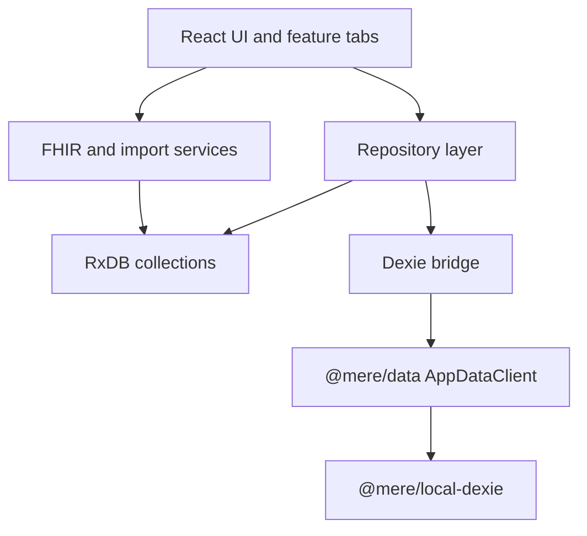

Mere Medical is designed so the browser can be the primary runtime. The optional API handles portal callbacks, while the personal record itself can be imported, edited, and exported locally.

## Current shape

RxDB remains the original store for much of the application. The Dexie implementation is the migration target for repository-backed data and is shaped around the future `AppDataClient` contract.

## Direction of travel

- Keep UI call sites talking to repositories or `@mere/data`, not directly to a database implementation.
- Keep stored records plain JSON, with epoch millisecond timestamps and app-level IDs.
- Move legacy snake_case and RxDB document behavior behind translators and bridge utilities.
- Treat `.emrpkg` import/export as a first-class boundary for local and serverless use cases.

## Related source docs

The older markdown source at `docs/architecture.md` has the detailed migration notes. This page is the Starlight landing page for the same architecture area.
