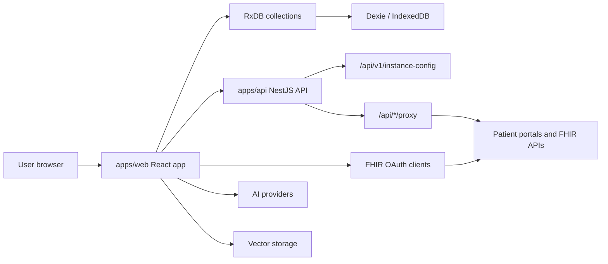

Mere Medical is local-first. The browser app owns most user workflows and stores user health data locally. The API supports deployment, configuration, proxying, and OAuth flows that cannot safely or reliably happen entirely in the browser.

## Web App

`apps/web` contains the React app. The main source folders are:

- `src/features`: Feature-oriented UI and workflow modules, such as connections, labs, medications, timeline, AI chat, vectors, settings, and sharing.
- `src/models`: RxDB document schemas and types for local collections.
- `src/repositories`: Data access helpers around RxDB collections.
- `src/services`: FHIR sync, EMR package import/export, AI providers, and other app services.
- `src/app/providers`: App-level providers for configuration, local database, notifications, and shared runtime state.
- `src/test-utils`: Test database setup and fixtures.

## API

`apps/api` is a NestJS app. It:

- Serves static assets through `StaticModule`.
- Exposes public runtime configuration through `ConfigModule`.
- Enables patient portal modules only when their required environment variables are present.
- Provides a guarded proxy endpoint for portal requests that require server-side proxying.
- Sets the global API prefix to `/api`.

Provider modules are conditionally registered in `apps/api/src/app/app.module.ts`.

Useful API surfaces for developers:

| Endpoint | Purpose |
| --- | --- |
| `GET /api/v1/instance-config` | Returns public runtime configuration for the web app. |
| `GET /api/v1/tenants` | Tenant discovery across configured providers. |
| `GET /api/v1/dstu2/tenants` | DSTU2 tenant discovery. |
| `GET /api/v1/r4/tenants` | R4 tenant discovery. |
| `?*/proxy?serviceId=&vendor=&target_type=&target=` | Guarded provider proxy for configured FHIR/OAuth services. |

The API should not become a medical-record storage service. User records should stay in the browser-local store unless a future feature explicitly changes that architecture and documents the privacy model.

## Local Data Flow

FHIR sync services fetch resources from patient portals, map each resource into a `ClinicalDocument`, and upsert documents into the local database. The app keeps raw source data in the document while also storing metadata used by lists, timelines, search, and summaries.

For cross-cutting data contracts, prefer:

- `packages/domain` for shared types and schemas.
- `packages/data` for persistence abstractions.
- `packages/local-dexie` for Dexie-backed storage and package import/export.

## Integration Flow

Provider-specific UI and sync code lives in `apps/web/src/services/fhir`. Shared OAuth client behavior lives in `libs/fhir-oauth`. Provider libraries such as `libs/epic` and `libs/cerner` hold reusable metadata and helpers.

When adding integration behavior:

1. Put reusable OAuth or protocol behavior in `libs/fhir-oauth`.
2. Put provider-specific sync orchestration in `apps/web/src/services/fhir/<Provider>.ts`.
3. Map raw FHIR resources through `DSTU2.ts` or `R4.ts`.
4. Persist through repository helpers instead of direct collection calls.
5. Add API support only when a flow needs server-side secrets, CORS proxying, or public runtime config.

## AI Features

AI-related UI and workflows live mainly in:

- `apps/web/src/features/ai-chat`
- `apps/web/src/features/ai-recommendations`
- `apps/web/src/services/ai`
- `apps/web/src/features/vectors`
- `libs/vector-storage`

AI code must treat health records as sensitive data. Prefer local providers or explicit user configuration, avoid logging record contents, and keep provider-specific keys out of committed code.
