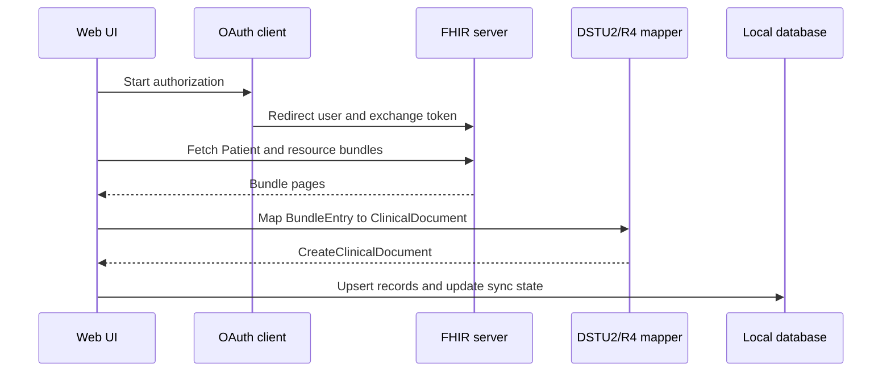

Mere Medical integrates with patient portals through SMART-on-FHIR and provider-specific OAuth flows. Most providers follow the same pattern: discover or configure endpoints, authenticate, fetch FHIR resources, map them into clinical documents, and upsert them into local storage.

## Integration Locations

| Provider or layer | Key files |
| --- | --- |
| Shared mappers | `apps/web/src/services/fhir/DSTU2.ts`, `apps/web/src/services/fhir/R4.ts` |
| Shared sync helpers | `apps/web/src/services/fhir/incrementalSync.ts`, `apps/web/src/services/fhir/ConnectionService.ts` |
| Epic/MyChart | `apps/web/src/services/fhir/Epic.ts`, `libs/epic`, `apps/api/src/app/epic` |
| Cerner | `apps/web/src/services/fhir/Cerner.ts`, `libs/cerner`, `apps/api/src/app/cerner` |
| Healow | `apps/web/src/services/fhir/Healow.ts`, `libs/healow`, `apps/api/src/app/healow` |
| OnPatient | `apps/web/src/services/fhir/OnPatient.ts`, `apps/api/src/app/onpatient` |
| Veradigm | `apps/web/src/services/fhir/Veradigm.ts`, `libs/veradigm`, `apps/api/src/app/veradigm` |
| VA | `apps/web/src/services/fhir/VA.ts` |
| Shared OAuth clients | `libs/fhir-oauth` |

## Typical Sync Flow

## Proxying

The API proxy is implemented by:

- `apps/api/src/app/proxy/controllers/proxy.controller.ts`
- `apps/api/src/app/proxy/services/proxy.service.ts`
- `apps/api/src/app/proxy/guards/origin.guard.ts`

Proxy requests require a `serviceId`. If multiple vendors expose the same service ID, the caller must also provide `vendor`. The proxy only forwards a small allowlist of request headers and injects bearer tokens unless a service explicitly disables token forwarding.

Use API proxying when:

- A portal blocks browser requests with CORS.
- A token or registration request needs server-side behavior.
- A provider requires an endpoint shape that cannot be called directly from the browser.

Avoid proxying when a standards-compliant browser SMART flow works directly. Direct browser calls reduce server responsibility and simplify deployment.

## Healow Modes

Healow supports two modes:

- Public-client mode: `HEALOW_CLIENT_ID` only. Uses PKCE, does not support refresh tokens, and users may need to re-authenticate when the access token expires.
- Confidential-client mode: `HEALOW_CLIENT_ID` plus `HEALOW_CLIENT_SECRET`. The server injects the secret during token exchange and enables refresh-token support.

The public runtime config exposes `HEALOW_CONFIDENTIAL_MODE` as a boolean so the web app can choose the right flow without exposing the secret.

## Adding Or Changing A Provider

1. Start with `libs/fhir-oauth` if the provider needs reusable OAuth client behavior.
2. Add provider-specific app orchestration in `apps/web/src/services/fhir`.
3. Add server endpoints in `apps/api/src/app/<provider>` only for secret handling, proxying, or callbacks.
4. Register the provider conditionally in `apps/api/src/app/app.module.ts`.
5. Add public config fields in `apps/api/src/app/config/config.service.ts` and `apps/web/src/app/providers/AppConfigProvider.tsx` if the browser needs to know the setting.
6. Map new FHIR resources in `DSTU2.ts` or `R4.ts`.
7. Add unit tests for OAuth helpers, resource mappers, sync state, and API behavior.

## Security Expectations

- Never expose client secrets through public config.
- Do not log access tokens, refresh tokens, FHIR bundles, or patient identifiers.
- Keep synthetic fixtures clearly synthetic.
- Prefer narrowly scoped OAuth permissions. If a provider requires broad scopes, document why in the setup guide or code comment.
