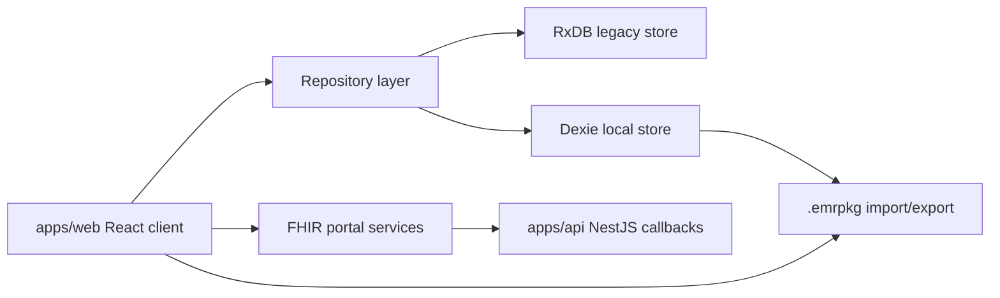

Mere Medical is a browser-first personal health record for aggregating, normalizing, and exporting health data across patient portals and portable record files.

## Start here

- [Project overview](./general/project-overview/) explains the app surfaces and the intended audience for these docs.
- [Local-first architecture](./architecture/local-first-architecture/) describes the current RxDB store, the Dexie migration path, and the future Convex-shaped interface.
- [EMR package format](./data-portability/emrpkg-format/) documents the `.emrpkg` archive format used for portable records.
- [Serverless mode](./operations/serverless-mode/) covers running the web app without the NestJS portal callback API.

## System map

